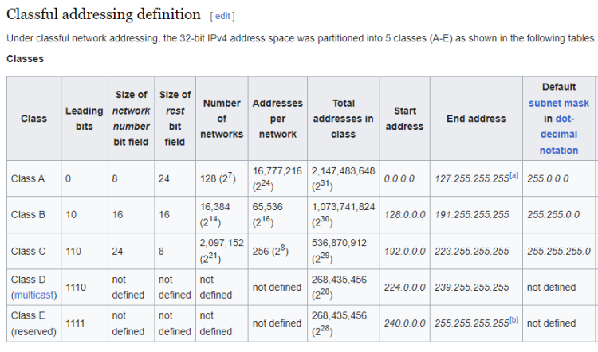

## Networking

### Concepts
- IP Address (IpV4 & IpV6): IPv4 or Internet Protocol version 4, address is a 32-bit string of numbers separated by periods
- subnetting: Subnetting is the practice of dividing a network into two or more smaller networks. 
- NAT: is a process of changing the source and destination IP addresses and ports.
- Gateway: 
- DNS
- VPN (Virtual Private Networks)
- Wide Area Networks (WAN)

IP Address is used to uniquely identify a device in a network

### What is IPv4 Address and its Role in the Network?

IpV4 address: IPv4 or Internet Protocol version 4, address is a 32-bit string of numbers separated by periods. It uniquely identifies a network interface in a device. IP Address is a 32 bit number. broken down into 4 octects (8 bit) x.x.x.x.

 Two power table [Reference Here!](https://www.mymathtables.com/numbers/power-exponentiation/power-of-2.html)

 Binary to decimal converter [Reference Here](https://www.rapidtables.com/convert/number/binary-to-decimal.html)

 Networking leraning [Reference here](https://study-ccna.com/)

- Two devices can communicate directly if they are in same network.

### Finding network ID and Host ID

Example:

IP: 192.168.100.198
SM: 255.255.255.0

octets with 255 => 1,2,3
  network ID: 192.168.100

octects with 0 => 4
  host id: 198

## Network size with CIDR ( classless interdomain routing )

*Example*

IP: 192.168.0.11
SM: 255.255.255.0
NID: 192.168.0
HID: 11

- All the devices in the nework would have same network ID. network id is fixed
- Network size - 2^(number of host id bits) - 2

HID = 1 octet = 8 bits
Network size = 2^8 - 2 = 256-2 = 254

The two which we have substracted represent two IP's
- Zero (192.168.0.0) => network id
- 255 (192.168.0.255) => broadcast address

To design networks we have two approaches:

1. Classfull networking

2. Classless networking (CIDR)

- Figure out number of bits for host ID and for network ID

**Example 1. A network with 200 devices**

2^n - 2 ~=200

n = 8 (number of zeros)

N = 32-8 = 24

SM: 11111111.11111111.11111111.00000000
SM: 255.255.255.0

**Example 2. A network of 500 devices**

2^n - 2 ~= 500

n = 15

N = 32 - 15 = 17

SM = 11111111.11111111.10000000.00000000
Sm: 255.255.128.0

- Public network
- Private network

## CIDR Notation
- is a method of public IP address assignment
- The CIDR notation is represent as x.x.x.x/N where N = number of 1's i.e network ID.
- to deal with the IPv4 address exhaustion problem
- to slow down the growth of routing tables on Internet routers

Before CIDR, public IP addresses were assigned based on the class boundaries:

- Class A – the classful subnet mask is /8. The number of possible IP addresses is 16,777,216 (2 to the power of 24).
- Class B – the classful subnet mask is /16. The number of addresses is 65,536
- Class C – the classful subnet mask is /24. Only 256 addresses are available.

A classful network was split into multiple smaller networks. **For example**, if a company needs 12 public IP addresses, it would get something like this: 190.5.4.16/28.

The number of usable IP addresses can be calculated with the following formula:

2 to the power of host bits – 2

In the example above, the company got 14 usable IP addresses from the 190.5.4.16 – 190.5.4.31 range because there are 4 host bits and 2 to the power of 4 minus 2 is 14 The first and the last address are the network address and the broadcast address, respectively. All other addresses inside the range could be assigned to Internet hosts.

**192.168.0.0/24**

|  IP | 192.  | 168.   | 0.   | 0   |
|---|---|---|---|---|
|  range| 192.  | 168.   | 0.   | 0.xxxxxxxx   |
|  Start |  192.  | 168.   | 0.   | 0   | 
|  end |  192.  | 168.   | 0.   | 0   | 

sm: 11111111.11111111.11111111.00000000

Start - 192.168.0.0

End - 92.168.0.255

**172.16.0.0/22**

|  IP | 172.  | 16.   | 0.   | 0   |
|---|---|---|---|---|
|  range|  172.  | 16.   | 000000xx. | xxxxxxxx  |
|  Start |   172.  | 16.   | 00000000.   | 00000000   |
|  end |   172.  | 16.   | 00000011.   | 11111111  | 

start - 172.16.0.0

end - 172.16.3.255

**Example**

IP: 10.128.0.0/13

N = 13 (1's)

n = 32-13 (0's) = 19

|  IP | 10.  | 128.   | 0.   | 0   |
|---|---|---|---|---|
|  range|  10.  | 10000xxx.   | xxxxxxxx. | xxxxxxxx  |
|  Start |   10.  | 10000000.   | 00000000.   | 00000000   |
|  end |   10.  | 10000111.   | 11111111.   | 11111111  | 

start - 10.128.0.0

End -10.135.255.255

sm: 11111111.11111000.00000000.00000000

**Example**

**IP: 192.168.130.0/23**

range:   192.     168.1000001x.xxxxxxxx

start:   192.     168.10000010.00000000 = 192.168.130.0

end:     192.     168.10000011.11111111 = 192.168.131.255

sm: 11111111.11111111.11111110.00000000

## subnetting
Process of creating multiple subnets from a larger network is called as subnetting

Subnet => sub network

### Scenario 1: Create a network of 1000 devices with 4 subnets

Assumptions:
We are creating private network
private network will have only the following ranges Refer Here
10.0.0.0 to 10.255.255.255 (10.0.0.0/8)
172.16.0.0 to 172.31.255.255 (172.16.0.0/12)
192.168.0.0 to 192.168.255.255 (192.168.0.0/16)
Lets find CIDR range of Network
2^n -2 ~= 1000
n = 10
N = 32-10 = 22
CIDR: 10.0.0.0/22

Lets find the CIDR Range for subnets
2^n - 2 ~= 250
n = 8
N = 32-8 = 24

Network SM: 11111111.11111111.11111100.00000000

Subnet SM:  11111111.11111111.11111111.00000000

10.0.000000yy.00000000

10.0.00000000.00000000 = 10.0.0.0/24

10.0.00000001.00000000 = 10.0.1.0/24

10.0.00000010.00000000 = 10.0.2.0/24

10.0.00000011.00000000 = 10.0.3.0/24

### Scenario 2

I need a network of 20000 devices with 2 subnets (10000 in each subnet)
Network CIDR

2^n - 2 ~= 20000

n = 15

N = 32-15 = 17

CIDR: 192.168.0.0/17

Subnet CIDR

2^n - 2 ~= 10000

n = 14

N = 32 -14 = 18

**Subnetting**

Network SM: 11111111.11111111.10000000.00000000

Subnet  SM  11111111.11111111.11000000.00000000

192.168.0y000000.

192.168.00000000.  => 192.168.0.0/18

192.168.01000000.  => 192.168.64.0/18