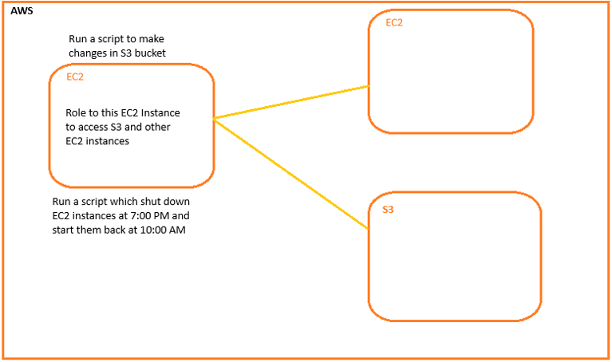

## IAM Policy Structure

    {
        "Version": "2012-10-17",
        "Id": "Policy1608868865480",
        "Statement": [
            {
                "Sid": "Stmt1608868785705",
                "Effect": "Allow",
                "Principal": {
                    "AWS": "arn:aws:iam::*:user/developer"
                },
                "Action": [
                    "s3:GetObject",
                    "s3:PutObject",
                ],
                "Resource": "arn:aws:s3:::ltsamples3/*"
            },
        ]
    }

**1. Version:** Policy Language `2012-17-10` \
**2. ID:** Identity for policy (optional) \
**3. Statement:** Statement consist of \
    *a. sid:* Identifier for the statement (required) \
    *b. Effect:* Allow | Deny (Statement) \
    *c. Principal:* Account | User | role \
    *d. Action:* list of actions this policy allows or denies \
    *e. Resources:* List of resources to which the action applied to

### IAM Role for services

Some AWS service will need to perform action on your behalf. To do so, we will assign permissions to AWS services with IAM role.

### Example: EC2 want perform some action on AWS service, 

create IAM Role.

### IAM Policy and Permission:

I am policy is an object in AWS associated with identity (user or group) or resource defines their permissions.

### Policies (json) 
AWS has different type of policies \
    1. Identity based \
    2. Resource based \
    3. Permission bounderies \
    4. AWS org service controll \
    5. ACL \
    6. Session policies

**1. Identity based:**

- The policies are attached to IAM identities (users, groups and roles)
- These policies grant permissions to an idenity.
- JSON Doc, that control what action an identity can perform.
- Categarized policies:
    - AWS Managed Policies:
    - Custom Managed Policies: Inline policies, that we add directly to a single / User / Group / Role.
    - Inline policies maintains strict one to one relationship.

**2. Resource Based Policies:**

- Attached to resources.
- S3 bucket policy and IAM Role.

**3. Permission Boundries:** Maximum permissions that the Identity based policy can grant to an entity.

**4. AWS organization service control:** \
AWS organization service control policy used to define the maximum permissions for account number of organization or organizational unit.

**5. ACL (Access Control List):**
- ACL's are used to control which principal in other account can access the resource to which the ACL is attach.
- Across account permissions.

*Note*: IAM Policy grammar. [Refer Here](https://docs.aws.amazon.com/IAM/latest/UserGuide/reference_policies_grammar.html)

Anything with ? is an optional (IAM Policy Grammar document)

        {
            <version_block?>
            <id_block?>
            <statement_block>
        }

Q. Write a policy using AWS IAM Policy Grammar

        {
            "version": "2012-10-17"
            "Statement": [
                {
                    "principal": "*",
                    "Effect": "Allow",
                    "Action": "*"
                    "Resource": "*"
                }
            ]
        }

Q. Write EC2 ReadOnlyPolicy.json policy

        {
            "version": "2012-10-17"
            "Statement": [
                {
                    "principal": "*",
                    "Effect": "Allow",
                    "Action": "EC2:Describe*"
                    "Resource": "*"
                },
                {
                    "Effect": "Allow"
                    "Action": "elasticloadbalancing!Describe*"
                    "Resource": "*"
                }
            ]
        }

Refer: AWS Policy simulator and AWS Policy Generator [Refer Her](https://awspolicygen.s3.amazonaws.com/policygen.html)

- In IAM Policy, if there is an action which is not specified is denied by default.
- ARN - Amazon Resource name

Scenario: Create an IAM policy to perform 
- All the read operation on s3 bucket
- All the action o RDS.

        Describe - Read 
        GetAccess - Read
        List - Read

        {
            "Action": ["s3:Get*", "s3:List*", "s3:Describe"],
            "Effect": "Allow",
            "Resource": "*"

        }

