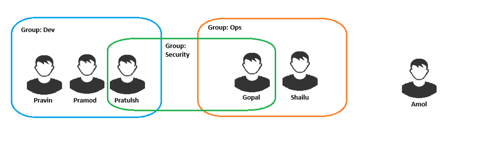

## AWS Identity and Access Management (IAM)

-  IAM stands for identity and access management. It is a global service.

- AWS IAM is a service offered by AWS that helps us to secure control access to AWS resources. We can use IAM to control who is authenticated (signed in) and authorized to user resources.

- Identities in AWS

  - **Users:** Individual accounts for real people or applications. Each user has specific credentials (like access keys and passwords) and permissions.

  - **Groups:** Collections of users. Permissions assigned to a group apply to all its members. Useful for managing common roles like Developers, DBAs, or QA Engineers. Groups can only contains users, not other groups.

  - **Roles:** Temporary access credentials with specific permissions. Roles are ideal for: Granting AWS services permissions to interact with other services (e.g., Lambda accessing S3)

