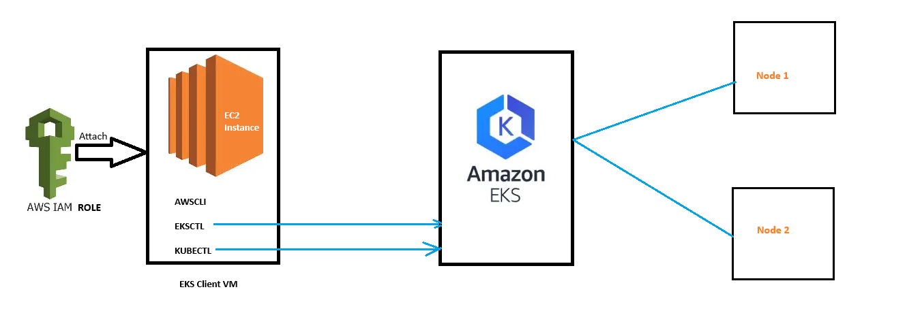
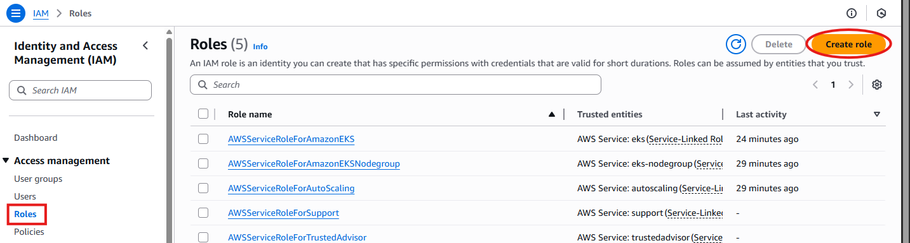

# Step - 1 : Create EKS Management Host in AWS

1. Launch new Ubuntu VM using AWS EC2 ( t2.micro )
2. Connect to machine and install kubectl using below commands

        curl -O https://s3.us-west-2.amazonaws.com/amazon-eks/1.33.0/2025-05-01/bin/linux/amd64/kubectl
        chmod +x ./kubectl
        sudo mv ./kubectl /usr/local/bin/kubectl
        which kubectl
        kubectl version --short --client
3. Install AWS CLI latest version using below commands

        sudo apt install unzip -y
        curl "https://awscli.amazonaws.com/awscli-exe-linux-x86_64.zip" -o "awscliv2.zip"
        unzip awscliv2.zip
        sudo ./aws/install

4. Install eksctl using below commands

        # for ARM systems, set ARCH to: `arm64`, `armv6` or `armv7`
        ARCH=amd64
        PLATFORM=$(uname -s)_$ARCH

        curl -sLO "https://github.com/eksctl-io/eksctl/releases/latest/download/eksctl_$PLATFORM.tar.gz"

        # (Optional) Verify checksum
        curl -sL "https://github.com/eksctl-io/eksctl/releases/latest/download/eksctl_checksums.txt" | grep $PLATFORM | sha256sum --check

        tar -xzf eksctl_$PLATFORM.tar.gz -C /tmp && rm eksctl_$PLATFORM.tar.gz

        sudo mv /tmp/eksctl /usr/local/bin

# Step - 2 : Create IAM role & attach to EKS Management Host

1. Create new IAM Role using IAM service and select use case EC2

2. Add below permissions for the Role

    - AdministratorAccess

3. Enter Role name (eks-cluster-role)
4. Attach created role to EKS management host:  EC2 - Actions - Security - Modify IAM role that we have created (eks-cluster-role)

# Step - 3 : Create EKS Cluster using eksctl

        eksctl create cluster \
        --name my-cluster \
        --region ap-south-1 \
        --nodes 3 \
        --node-type t3.medium \
        --zones ap-south-1a,ap-south-1b \
        --managed

###  Step - 4: After your practice, delete Cluster and other resources we have used in AWS Cloud to avoid bolling

        eksctl delete cluster --name my-cluster --region ap-south-1

